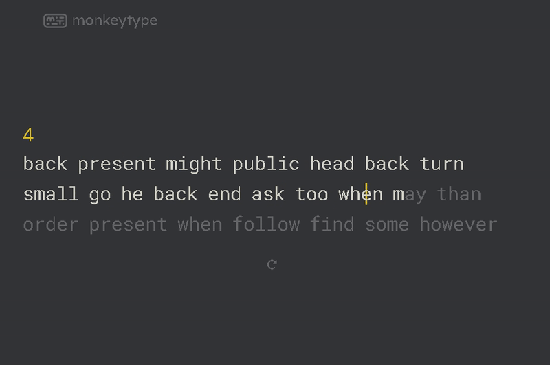

# Monkey Typer

Typing bot for <https://monkeytype.com>.



## Install Dependencies

Install the necessary dependencies.

```text
pip install -r requirements.txt
```

## Notes

Type 'start' in the terminal to start typing.

Type 'stop' in the terminal to stop typing.

Type 'quit' to exit the program.
