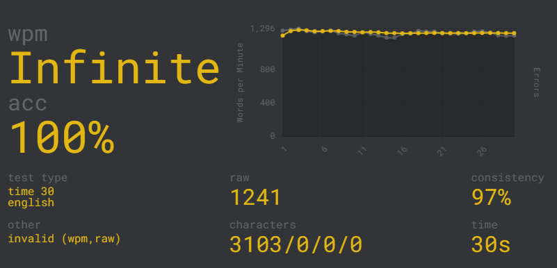

# Monkey Typer

Typing bot for <https://monkeytype.com>.



## Python Version

This project was developed using Python 3.10.10.

## Install Driver

The web crawler depends on the Selenium Python library, which requires a browser driver. I used Google Chrome, so I will need a Chrome driver. You can find the latest Chrome drivers [here]( https://chromedriver.chromium.org). Note that the driver and browser versions must be the same.

Make sure to put your driver in the "driver" folder.

## Install Dependencies

Install the necessary dependencies.

```text
pip install -r requirements.txt
```

## How To Use

Just run `main.py`.

You can adjust the delay to make typing slower or faster.

```python
delay = 0 # the delay between each letter typed
```

Type 'start' in the terminal to start typing.

Type 'stop' in the terminal to stop typing.

Type 'quit' to exit the program.

## Things To Note

Monkey Type has bot detection, so your account can get banned.
